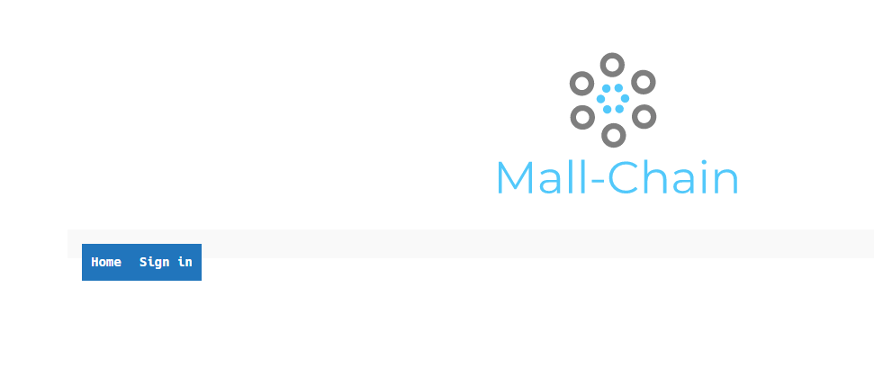
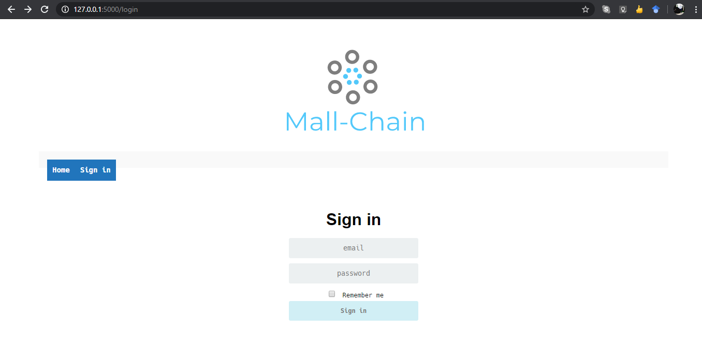
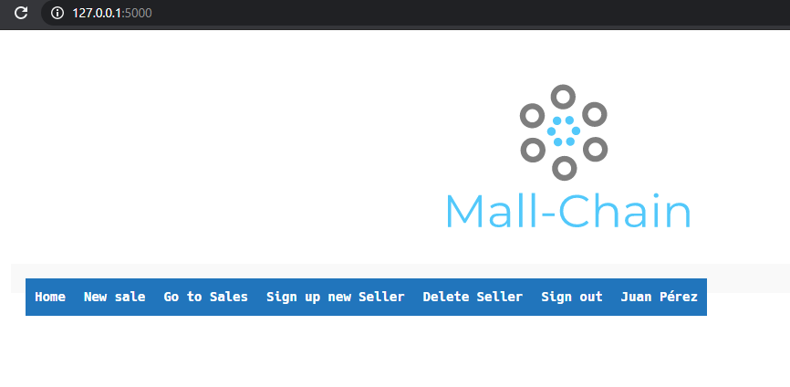
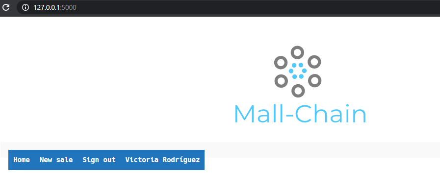
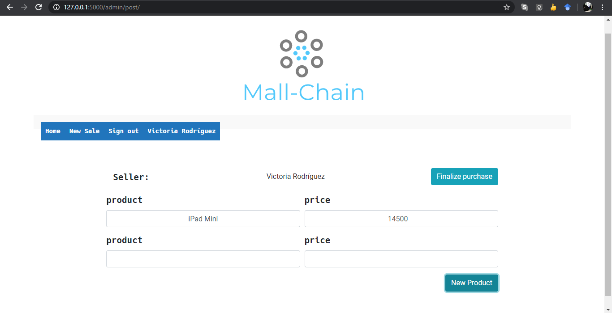
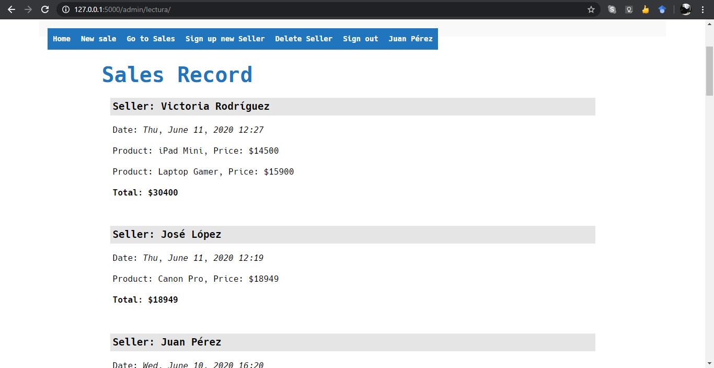

# Mall-Chain

Proyecto Final de la materia de Criptografía, implementación de una permissioned blockchain

## Pre-requisitos

El proyecto se ejecuta utilizando Python versión 3.7+

Instale los requerimientos para la ejecución del código
```sh
$ cd Proyecto_Final/
$ pip install -r requirements.txt 
```

### Mongodb
#### Windows
* Descargue el archivo msi [aqui](https://fastdl.mongodb.org/win32/mongodb-win32-x86_64-2012plus-4.2.7-signed.msi) e instálelo
* Cree la carpeta C:\data\db
* Ejecute en un terminal (CMD): C:\Program Files\MongoDB\Server\4.2\bin\mongod.exe

#### Linux: Debian-Ubuntu
* Ejecute los siguientes comandos para la instalación
```sh
$ sudo apt update
$ sudo apt install mongodb
$ sudo mkdir -p /data/db
$ sudo chmod -R 777 /data
```
* Asegúrese de que mongod esté activado con:
```sh
$ service mongodb status
```
En caso de que no lo esté inicielo con:
```sh
$ sudo service mongodb start
```

## Ejecución

Para iniciar un nodo del servidor Blockchain
En un terminal ejecute:
```sh
$ export FLASK_APP=node_server.py # Para Windows cambie export por set
$ flask run --port 8000
```

En un terminal diferente ejecute:
```sh
$ cd app/
$ export FLASK_APP=run.py # Para Windows cambie export por set
$ flask run
```

La aplicación se ejecutará en [http://127.0.0.1:5000/](http://127.0.0.1:5000/)

Interfaz de usuario

1. Página principal: en está se encuentra la opción para iniciar sesión en la plataforma


2. Inicio de sesión: se tienen dos tipos de usuarios Administrador y vendedor, quienes pueden iniciar sesión con este formulario para ingresar a la plataforma.

    
    * Administrador: el administrador puede registrar nuevas transacciones o ventas, observar el registro de todas las ventas que se hayan realizado, así como agregar y eliminar nuevos usuarios de tipo vendedor.

        Como ejemplo de administrador se puede ingresar con las credenciales:
        
        user: juan@mallchain.com
        
        password: admin
        
    
    * Vendedor: los vendedores solo pueden registrar nuevas ventas.

        Como usuario vendedor de ejemplo se tienen las credenciales:
        
        user: victoria@mallchain.com
        
        password: employee1

    

    En ambos casos, los bloques con las transacciones creadas se minan al momento de cerrar sesión.

3. Generar ventas (transacciones): para generar nuevas transacciones se tiene el formulario mostrado en la imagen, en ella se escribe el nombre del producto y su costo. Para agregar varios productos se tiene el botón New Product y para terminar la transacción se utiliza el botón Finalize Purchase


4. Registro de ventas: el administrador puede visualizar el registro de ventas, en el que se listan todas las transacciones que se han realizado.



### Ejecución con varios nodos

Para ejecutar el proyecto con varios nodos puede realizar lo siguiente (ejemplo para dos nodos):

```sh
# Creación de dos nodos blockchain
$ export FLASK_APP=node_ser.py # Para Windows cambie export por set
$ flask run --port 8000 &
$ flask run --port 8001 &
```
En un terminal diferente ejecute:
```sh
# Para diferentes servidores web
$ export FLASK_APP=run.py # Para Windows cambie export por set
$ flask run &
$ flask run --host 127.0.0.2 &
```
Ahora tiene dos entornos de la aplicación ejecutandose en [http://127.0.0.1:5000/](http://127.0.0.1:5000/) y [http://127.0.0.2:5000/](http://127.0.0.1:5000/) aunque ambas corriendo con el nodo de blockchain en el puerto 8000

Para cambiar el node_server de alguna de las ejecuciones realice:
```sh
$ curl -X POST \
    http://127.0.0.2:5000/defServer \
    -H 'Content-Type: application/json' \
    -d '{"server": "http://127.0.0.1:8001" }'
```

Ahora tendrá dos nodos del blockchain, cada uno con una interfaz propia. Sin embargo para comunicar ambos nodos es necesario que cada nodo se registre con el otro u otros
```sh
# Para registrar al nodo que corre en el puerto 8000 con el que corre en el puerto 8001
$ curl -X POST \
  http://127.0.0.1:8000/register_with \
  -H 'Content-Type: application/json' \
  -d '{"node_address": "http://127.0.0.1:8001"}'
```

```sh
# Para registrar al nodo que corre en el puerto 8001 con el que corre en el puerto 8000
$ curl -X POST \
  http://127.0.0.1:8001/register_with \
  -H 'Content-Type: application/json' \
  -d '{"node_address": "http://127.0.0.1:8000"}'
```